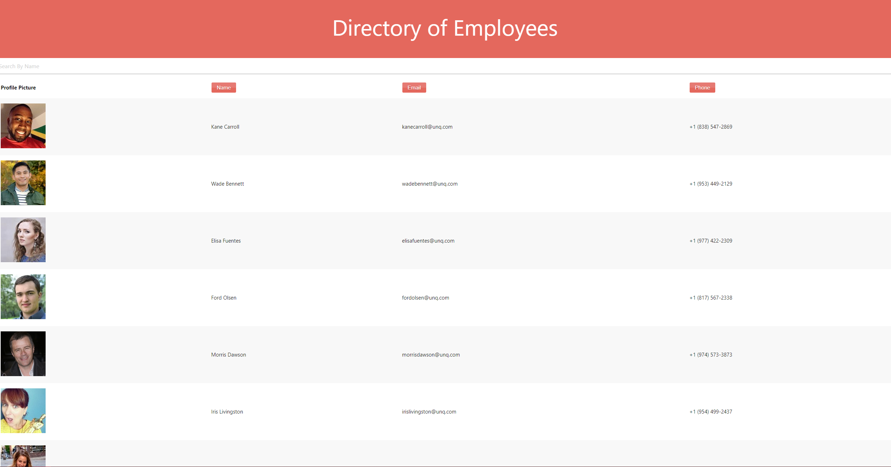

# Directory of Employees

## Description

React Employee Directory with sortable options.

## Table of Contents

- [Installation](##Installation)
- [Usage](##Usage)
- [Contributers](##Contributers)
- [License](##License)
- [Tests](##Tests)
- [Questions](##Questions)

## Installation

npm i to install required modules

## Usage

npm start will start the web application. the user is then presented with a table of employess that they can sort by category or search for an employee by name.

## License

This project uses the MIT_License license.

## Contributers

React HTML CSS NODE Materialize JSON

## Tests

npm test

## Images

## Questions

If you have any questions or suggestions, please contact me here:
[oscar.oses.1127@gmail.com](oscar.oses.1127@gmail.com)
